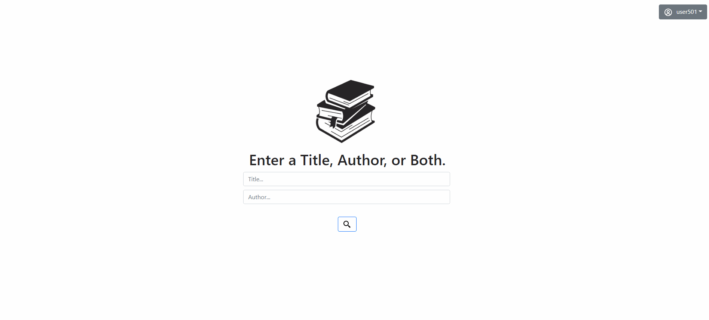
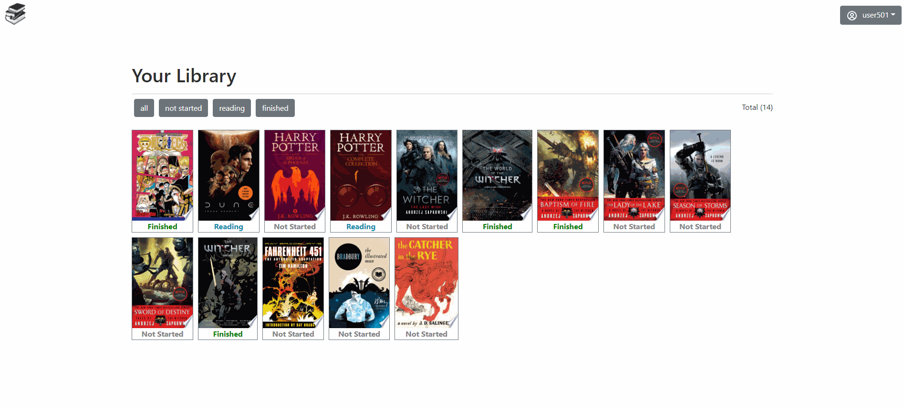

# Reader Tracker

https://reader-tracker.herokuapp.com/

Reader Tracker is a full MERN stack application that allows users to organize and track book reading progress between three statuses - not started, reading, and finished, as well as allowing users to rate their finished books on a 5 star rating scale. Users will search for books via the Google Books API to find their desired book and add it to their collection to begin tracking their progress.

## Technologies

**comprehensive list of all front-end and back-end technolgies used**

- Typescript
- ReactJS
- Redux
- React-Router-Dom
- NodeJS
- Express
- Axios
- MongoDB w/ Atlas
- Bootstrap

## API

The main functionality of the app to begin a user library - the search function - communicates with Google's Google Books API. Visit [the offical documentation](https://developers.google.com/books/docs/overview) to learn more about this particular api.

## Data handling with MongoDB

All user specific data collection and storage in the app is done with the no sql database known as MongoDB. Communication with the db is done through the native mongodb driver and the db itself is hosted on Mongo's very own cloud database service, Atlas.

## Users Collection

In the db there is a 'users' collection that holds all information inputted by a user upon account registration.

```
 let userDocument = {
                "name" : `${username}`,
                "email" : `${email}`,
                "password" : `${hashed}`,
                "all_books": []
            }
```

Before assigning the user's password in the document, bcryptjs is used to hash the password. The 'all_books' array will collect all books the user adds to their library, any filtering between the three stages of reading progress are handled dynamically on the front end, so only one array holding all books are necessary in the db. Each added book in the 'all_books' array are stored as an object with the following structure

```
$addToSet: {
            all_books: {
                        title,
                        author,
                        pages,
                        image,
                        status: 'Not Started',
                        rating: 0,
                        bookID
                        }
                    }
```

Each book is uniquely identified by an ISBN code provided by the Google Books API.

## Screenshots & GIFS



<!--  -->


